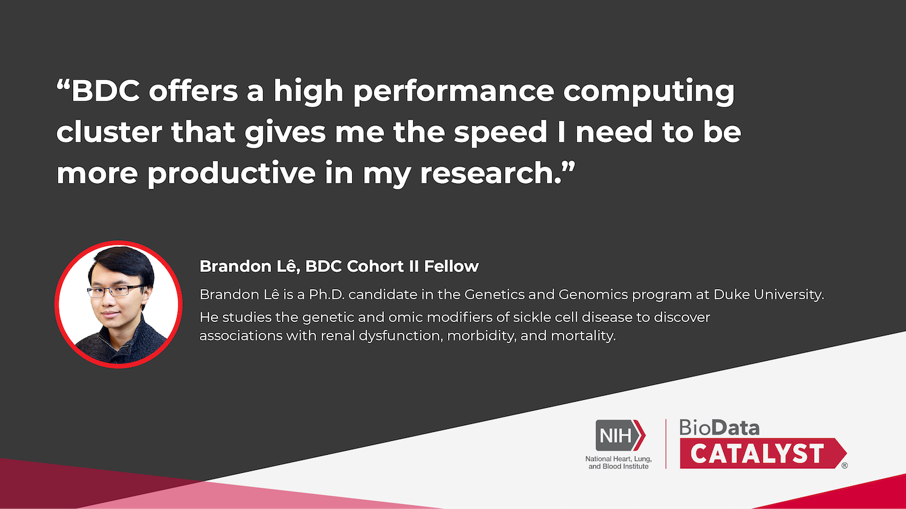

Join us on [Wednesday, September 13th at 1:00 pm ET](https://renci.zoom.us/meeting/register/tJcoc-2vrzouGdXVpgP_l5DCXVd1ONu-nNgj) for BDC Community Hours. This informal, virtual event  will be focused on Sickle Cell Disease datasets and research in BioData Catalyst. 

Sickle Cell Disease specific datasets have been ingested into BioData Catalyst that are of value and interest to Sickle Cell Disease researchers. Join this session to learn about the data and features and hear firsthand the use case of a researcher successfully using the ecosystem for Sickle Cell Disease research.

  

After a presentation and demo on these topics, time will be made available for discussion and to address questions, challenges, and issues you might be facing in the ecosystem.

All users are invited to attend, whether you are new to BioData Catalyst or have been using it for some time. If you are not yet registered for the ecosystem, we welcome you to [join our community](https://biodatacatalyst.nhlbi.nih.gov/contact/ecosystem). If you cannot attend on this date, you can still sign up and the recording and slides will be sent to you.

You are welcome to anonymously [include your questions in advance](https://forms.gle/JpNWQbLXoxzro5zi9) or bring your discussion topics to the session live.

Make sure to [register now](https://renci.zoom.us/meeting/register/tJcoc-2vrzouGdXVpgP_l5DCXVd1ONu-nNgj) - we look forward to seeing you!

### What are Community Hours?

BDC Community Hours is a monthly, hour-long event where users can learn about features of the ecosystem. The hour is split into time for presentation by a platform team and time for questions. Teams will showcase tools, new features, or tips that meet user needs. After the presentations, time is available for discussion and questions for platform reps from users.