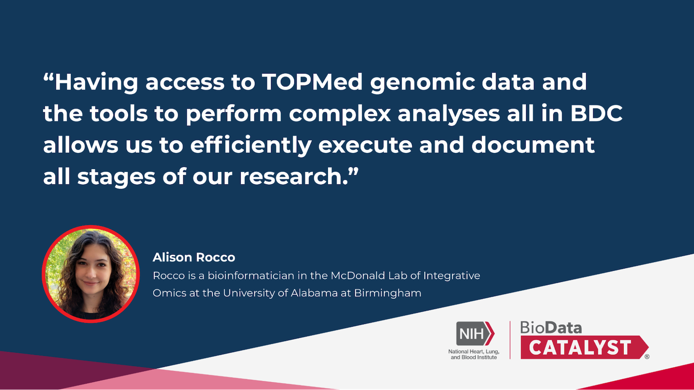

Join us on Wednesday, November 15 at 1 PM ET for BDC November Community Hours: Researching the Genetics of Lung Diseases and Building Custom Workflows on BDC. Joe Chiles and Alison Rocco from the [McDonald Laboratory of Integrative 'Omics](https://sites.uab.edu/mcdonaldlab/) at the University of Alabama at Birmingham will be presenting their research into the genetic risk factors for weight loss in people living with chronic obstructive pulmonary disease (COPD). Rocco, a research intern and undergraduate bioinformatician in the McDonald Lab of Integrative Omics, describes the benefits of using BDC saying that, "having access to TOPMed genomic data and the tools to preform complex analyses all in BDC allows us to efficiently execute and document all stages of our research."

  

They will highlight the availability of pulmonary data in different studies from the Trans-Omics for Precision Medicine (TOPMed) initiative and demonstrate how they deployed this data to study genetic risk variants for weight loss in the COPD population.  They will also describe how to create tools that customize the output of public workflows on BDC to facilitate further analysis.

Even if you cannot attend the session live, you can still [register](http://bit.ly/BDC-Nov) to have the session recording and slides sent to you post-event.

Time will be made available for discussion and to address questions, challenges, and issues you might be facing in the ecosystem. You are welcome to [anonymously include your questions in advance](https://forms.gle/iPifJTM5q2eeKa7UA) or bring your discussion topics to the session live.

All users are invited to attend, whether you are new to BDC or have been using it for some time. If you are not yet registered for the ecosystem, we welcome you to [join our community](https://biodatacatalyst.nhlbi.nih.gov/contact/ecosystem/).

Make sure to [register now](http://bit.ly/BDC-Nov) - we look forward to seeing you!

### What are Community Hours?

BDC Community Hours is a monthly, hour-long event where users can learn about features of the ecosystem. The hour is split into time for presentation by a platform team and time for questions. Teams will showcase tools, new features, or tips that meet user needs. After the presentations, time is available for discussion and questions for platform reps from users.