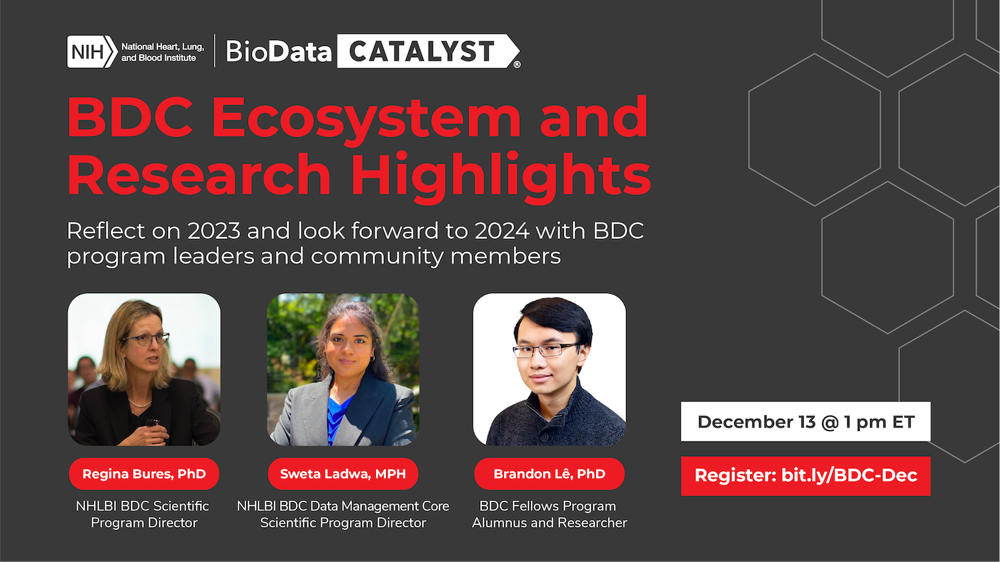

Join us on Wednesday, December 13 at 1 PM ET for BDC December Community Hours: Ecosystem and Research Highlights. During this session, program leaders, researchers, and BDC community members will recap the highlights of the ecosystem in 2023, and look toward 2024. Highlights include global recognition for the work of BDC researchers and the ecosystem, data ingestion of six Sickle Cell Disease data sets, a December Request for Information opportunity to contribute to the NHLBI strategic plan, and more.

  

Even if you cannot attend the session live, you can still [register](http://bit.ly/BDC-Dec) to have the session recording and slides sent to you post-event.

Time will be made available for discussion and to address questions, challenges, and issues you might be facing in the ecosystem. You are welcome to [anonymously include your questions in advance](https://forms.gle/iPifJTM5q2eeKa7UA) or bring your discussion topics to the session live.

All users are invited to attend, whether you are new to BDC or have been using it for some time. If you are not yet registered for the ecosystem, we welcome you to [join our community](https://biodatacatalyst.nhlbi.nih.gov/contact/ecosystem/).

Make sure to register at <http://bit.ly/BDC-Dec> - we look forward to seeing you!

### What are Community Hours?

BDC Community Hours is a monthly, hour-long event where users can learn about features of the ecosystem. The hour is split into time for presentation by a platform team and time for questions. Teams will showcase tools, new features, or tips that meet user needs. After the presentations, time is available for discussion and questions for platform reps from users.