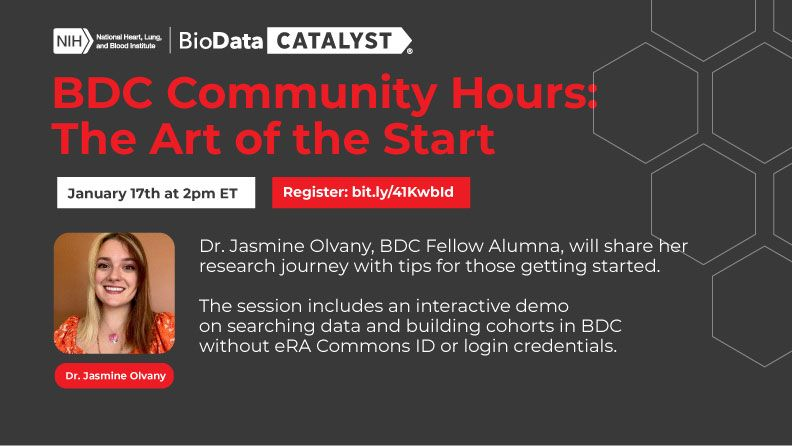

  

Join us on [Wednesday, January 17 2pm ET](https://renci.zoom.us/webinar/register/6517025718497/WN_O0SRkPrnREqb5RN-Gz_lQg) for a session on the Art of the Start.

For our first Community Hours of 2024, Dr. Jasmine Olvany spoke to current and potential BDC users about her experience with the ecosystem's data, analytical tools, and secure workspaces for her malaria research.

We also hosted a demo on searching data and building cohorts without needing an eRA Commons ID or logins with Emily Hughes.

[Access session materials](https://bdcatalyst.freshdesk.com/support/discussions/topics/60000407644), including videos and links.

If you are not yet registered for the ecosystem, we welcome you to [join our community](https://biodatacatalyst.nhlbi.nih.gov/contact/ecosystem/).
### What are Community Hours?

BDC Community Hours is a monthly, hour-long event where users can learn about features of the ecosystem. The hour is split into time for presentation by a platform team and time for questions. Teams will showcase tools, new features, or tips that meet user needs. After the presentations, time is available for discussion and questions for platform reps from users.