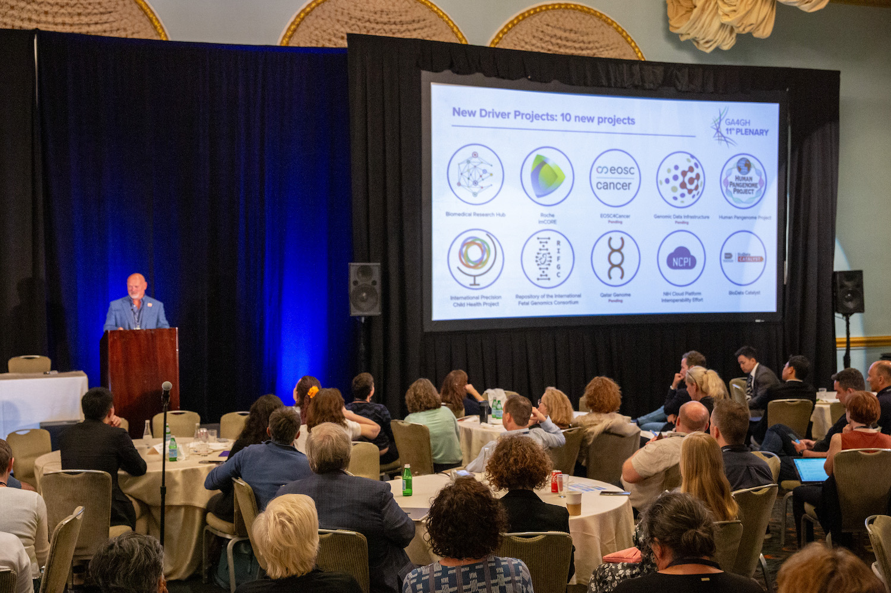
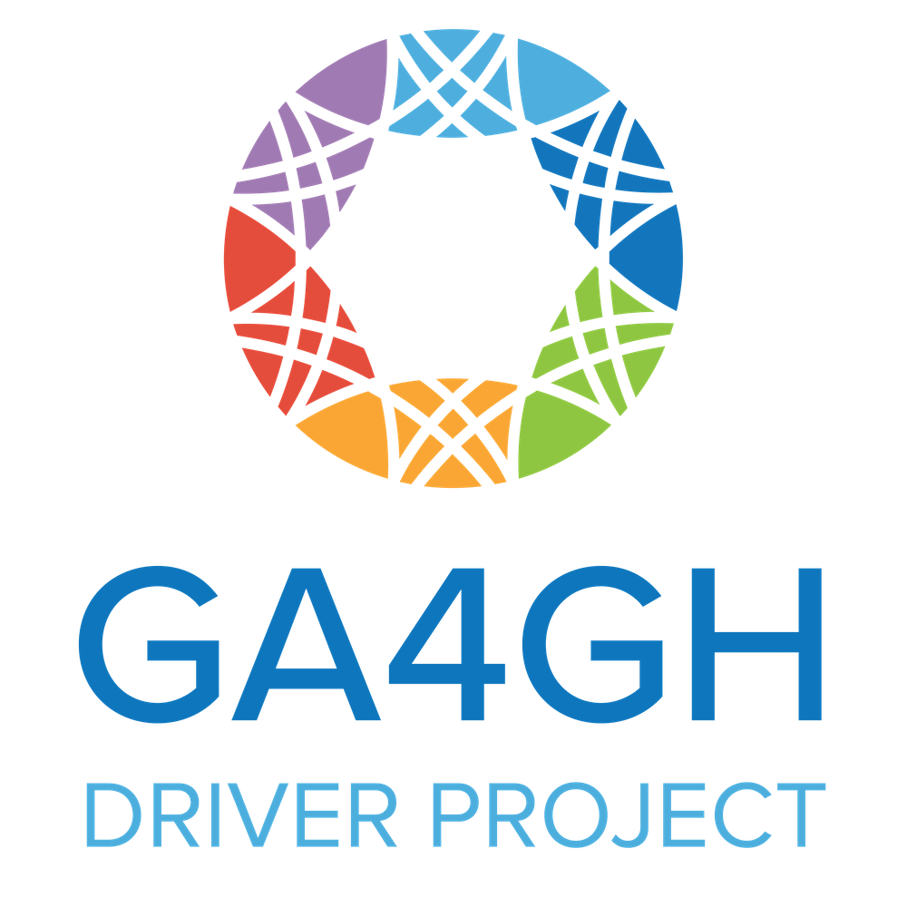

  
  <figcaption>BDC was named as a GA4GH Driver Project during the GA4GH 11th Plenary meeting in San Francisco. Pictured is GA4GH CEO Peter Goodhand making the announcement. Photo Credit: Jaclyn Ryan</figcaption>

The Global Alliance for Genomics and Health ([GA4GH](https://www.ga4gh.org/)) announced on September 20, 2023, that NHLBI BioData Catalyst (BDC) was named one of seven new [2023 GA4GH Driver Projects](https://www.ga4gh.org/news_item/2023-driver-projects/). Three more projects are expected to join in the coming weeks.

According to GA4GH, "projects were evaluated on their ability to expand GA4GH's global geographic footprint and application to global health, as well as to contribute to GA4GH activities. All projects have a mission and goals that depend on real-world genomic interoperability."

"BDC is pleased to have been selected as a GA4GH Driver Project. Our goals as a Driver Project include contributing to standards development for multimodal data and working to support international interoperability," said Regina Bures, Ph.D., Scientific Program Director for BioData Catalyst and Senior Scientific Advisor in the Division of Cardiovascular Sciences at the National Heart, Lung, and Blood Institute.

  

[National Institutes of Health (NIH) Cloud Platform Interoperability (NCPI)](https://anvilproject.org/ncpi), to which BDC actively contributes, was also named a 2023 GA4GH Driver Project. "We look forward to working with NCPI, the other Driver Projects, and GA4GH," continued Bures.

BDC and NCPI join several other NIH initiatives as [GA4GH Driver Projects](https://www.ga4gh.org/our-community/driver-projects/). GA4GH Driver Projects collaborate with other GA4GH partners, contributing to the development of GA4GH standards and piloting those standards.

[Read the full release](https://www.ga4gh.org/news_item/2023-driver-projects/) outlining this year's selected GA4GH Driver Projects.
