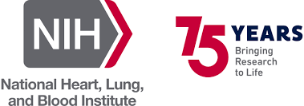

  

When President Harry S. Truman signed the National Heart Act on June 16, 1948, establishing the National Heart Institute, he likely did not envision the potential for data science to significantly advance biomedical research and enhance the well-being of people globally. Now, 75 years later, the Institute is called the National Heart, Lung, and Blood Institute (NHLBI), and its mission includes heart, lung, blood, and sleep research. NHLBI also hosts both the National Center on Sleep Disorders Research (NCSDR) and the Center for Translation Research and Implementation Science (CTRIS), and for nearly two decades, it has supported data science programs because, like its many other activities, they drive scientific discovery.

As part of its 75^th^ Anniversary celebration, NHLBI is sharing stories about how the Institute has leveraged the public's investments to save and improve lives, build a stronger workforce, and turn scientific discovery into better health. So, it is no surprise **that BDC was recently featured in a series called *Making a Difference***. The piece about BDC featured Jasmine Olvany, Ph.D., who was a BDC fellow in Cohort III and currently works as a Research Project Manager in Ohio. During Dr. Olvany's time as a fellow, she worked on solutions to help health professionals detect malaria in infected people who do not show symptoms.

"The computational power behind cloud platforms like BDC is absolutely invaluable for big data research because it took something that felt impossible and made it happen in a week or two weeks. It was really amazing." Dr Olvany said recently at BDC's Community Hours, where she discussed her research journey. She discussed how using BDC was a game changer due to the amount of computational power required. "The first thing that was really a breakthrough for my research was BDC because this is where I transitioned into doing the research on the cloud computation platform."

Read the [Making a Difference story featuring Dr. Olvany](https://www.nhlbi.nih.gov/75years/making-a-difference/meet-nhlbi-bioData-catalyst) on the NHLBI website.

Watch Dr. Olvany's recent presentation on [BDC's YouTube Channel](https://gcc02.safelinks.protection.outlook.com/?url=https%3A%2F%2Fyoutu.be%2FNOiPCpTi69Y%3Fsi%3D5oNN4TD-8wsSPVWF&data=05%7C02%7Clauren.hochman%40nih.gov%7Cf5bde266acd045c4fd5e08dc1871967e%7C14b77578977342d58507251ca2dc2b06%7C0%7C0%7C638412123352176533%7CUnknown%7CTWFpbGZsb3d8eyJWIjoiMC4wLjAwMDAiLCJQIjoiV2luMzIiLCJBTiI6Ik1haWwiLCJXVCI6Mn0%3D%7C3000%7C%7C%7C&sdata=CvOKYbP6MYcmH%2FlH6ytprrYhRP30CctrcT6t4I8cN3Y%3D&reserved=0).