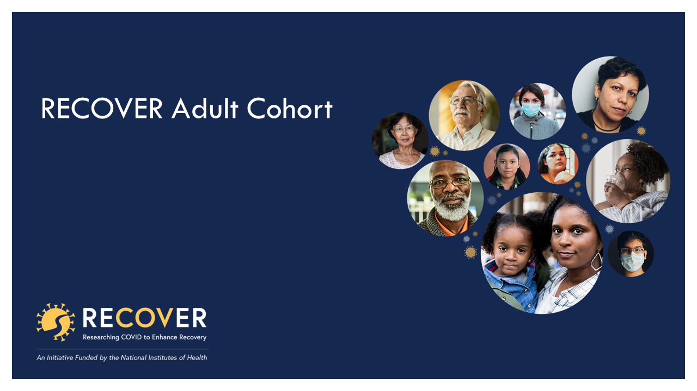

Reproducing published findings and reusing data collected from RECOVER studies have the potential to improve our understanding of Long COVID and increase the likelihood of finding treatments that improve the lives of people living with it. Making the Researching COVID to Enhance Recovery (RECOVER) Initiative data available to a broader community of researchers improves those odds.

  

For the first time*, RECOVER data is being made available in NHLBI BioData Catalyst® (BDC), the same cloud-based ecosystem RECOVER investigators have available for storing and analyzing the data they collect from their studies. The current release is a subset of data that includes survey and laboratory results from the RECOVER adult cohort study. This dataset has data from over 14,600 participants who participated in over 92,350 study visits at 79 enrolling sites across the country.

Users may explore study data (aggregate counts returned only) without going through an approval process. However, individual-level RECOVER data are only available via a controlled-access process requiring investigators to have <a href="https://public.era.nih.gov/commonsplus/public/login.era?TARGET=https%3A%2F%2Fpublic.era.nih.gov%3A443%2Fcommons" target="__blank" rel="noopener noreferrer">NIH Electronic Research Administration (eRA) Commons</a> credentials and receive data access permissions through the Data Access Request (DAR) process of the <a href="https://www.ncbi.nlm.nih.gov/gap/" target="__blank" rel="noopener noreferrer">NIH's Database of Genotypes and Phenotypes (dbGaP)</a>. This process protects study participant privacy while creating more opportunities for data analysis and scientific discoveries.

By sharing the data through BDC, researchers can use an ecosystem built by the National Heart, Lung, and Blood Institute (NHLBI) to provide accessibility to data, analytic tools, applications, and workflows in secure workspaces. <a href="/resources/data">BDC hosts many other datasets</a>, including those from the NHLBI Trans-Omics for Precision Medicine (TOPMed), several sickle cell disease studies, and other COVID research (<a href="https://www.ncbi.nlm.nih.gov/projects/gap/cgi-bin/study.cgi?study_id=phs002694.v1.p1" target="__blank" rel="noopener noreferrer">ACTIV4a</a>, 
<a href="https://www.ncbi.nlm.nih.gov/projects/gap/cgi-bin/study.cgi?study_id=phs002710.v1.p1" target="__blank" rel="noopener noreferrer">ACTIV4b</a>, 
<a href="https://www.ncbi.nlm.nih.gov/projects/gap/cgi-bin/study.cgi?study_id=phs003063.v1.p1" target="__blank" rel="noopener noreferrer">ACTIV4c</a>, 
<a href="https://www.ncbi.nlm.nih.gov/projects/gap/cgi-bin/study.cgi?study_id=phs002752.v1.p1" target="__blank" rel="noopener noreferrer">C3PO</a>, 
<a href="https://www.ncbi.nlm.nih.gov/projects/gap/cgi-bin/study.cgi?study_id=phs002299.v1.p1" target="__blank" rel="noopener noreferrer">ORCHID</a>, 
<a href="https://www.ncbi.nlm.nih.gov/projects/gap/cgi-bin/study.cgi?study_id=phs002363.v1.p1" target="__blank" rel="noopener noreferrer">RED CORAL</a>).

As more RECOVER data go through NIH's normative process for sharing de-identified research results, they will also be made available in BDC to authorized researchers. Those interested in learning more about RECOVER data in BDC, reading the RECOVER data release notes, exploring aggregated study information about the data, or accessing individual-level data will find more information and instructions on the [RECOVER @ BDC webpage](/recover).

For more information about the RECOVER Initiative, visit this website: <a href="https://recovercovid.org/" target="__blank" rel="noopener noreferrer" class="blog-external-link">https://recovercovid.org/</a>.

To stay up to date on RECOVER data in BDC and other BDC news, [join the BDC community](/contact/ecosystem).

<em>
*Previously, a de-identified data file of RECOVER data from the JAMA publication, "Development of a Definition of Postacute Sequelae of SARS-CoV-2 Infection," published on May 25, 2023, <a href="https://recovercovid.org/data" target="__blank" rel="noopener noreferrer" class="blog-external-link">was made available</a> to those who requested and received data access.</em>
