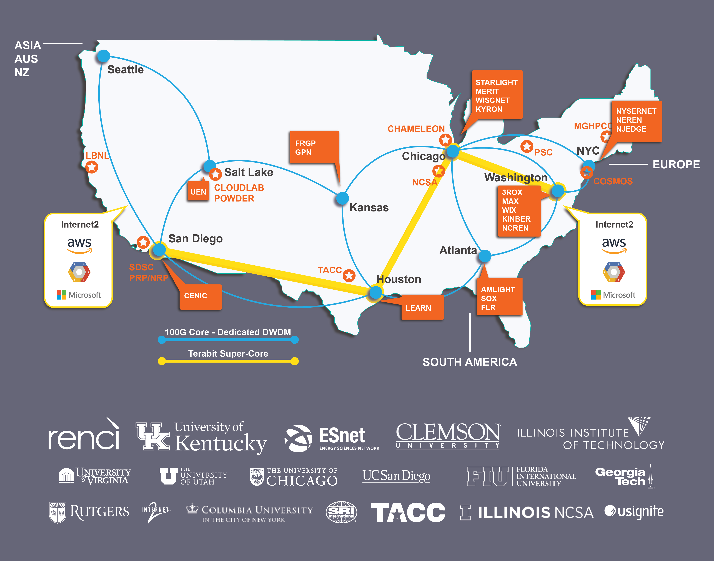

The [National Science Foundation](https://www.google.com/url?sa=t&rct=j&q=&esrc=s&source=web&cd=1&cad=rja&uact=8&ved=2ahUKEwiiyLPkyI_lAhUuh-AKHayxA2QQFjAAegQIBRAC&url=https%3A%2F%2Fwww.nsf.gov%2F&usg=AOvVaw1pYBfoPO9qDuWI1bNcNaHV) (NSF) [announced this week](https://nsf.gov/awardsearch/showAward?AWD_ID=1935966&HistoricalAwards=false) a collaborative project to create a platform for testing novel internet architectures that could enable a faster, more secure Internet. 

FABRIC will provide a nationwide testbed for reimagining how data can be stored, computed and moved through shared infrastructure. FABRIC will allow scientists to explore what a new Internet could look like at scale and will help determine the internet architecture of the future. 

A series of government-funded programs from the 1960s through the 1980s established the computer networking architectures that formed the basis for today’s internet. FABRIC will help test out new network designs that could overcome current bottlenecks and continue to extend the Internet’s broad benefits for science and society. FABRIC will explore the balance between the amount of information a network maintains, the network’s ability to process information, and its scalability, performance and security. 

“The Internet has been a great enabler for many science disciplines and in people’s everyday lives, but it is showing its age and limitations, especially when it comes to processing large amounts of data. If computer scientists were to start over today, knowing what they now know, the Internet might be designed in a different way,” said Ilya Baldin, director of [Network Research & Infrastructure](https://nrig.renci.org) at [RENCI](https://www.renci.org/), the UNC-Chapel Hill institute that serves as the project’s lead institution. 

“FABRIC represents large-scale network infrastructure where the Internet can be reimagined, and a variety of ideas can be tried out and compared. If FABRIC allows the research community to come up with ideas on how to reimagine the Internet based on a new set of architectural tradeoffs, then everybody wins – researchers and citizens alike,” said Baldin. 

Today’s Internet was not designed for the massive data sets, machine learning tools, advanced sensors and Internet of Things devices that have become central to many research and business endeavors. FABRIC will give computer scientists a place to test networking and cybersecurity solutions that can better capitalize on these tools and potentially extend the Internet’s benefits to people in remote or underserved areas. 

“We look forward to FABRIC enabling researchers throughout the nation to develop and test new networking technologies and capabilities,” said Erwin Gianchandani, acting assistant director for computer and information science and engineering at the National Science Foundation. “This project will lead to novel paradigms for next-generation networks and services, giving rise to future applications advancing science and the economy.”
 
FABRIC will consist of storage, computational and network hardware nodes connected by dedicated high-speed optical links. In addition to the interconnected deeply-programmable core nodes deployed across the country, FABRIC nodes will include major national research facilities such as universities, national labs and supercomputing centers that generate and process enormous scientific data sets. Such flexibility and control over the network functionality (at all points in the network) will allow experimenters to test new architectures not possible today. All major aspects of the FABRIC infrastructure will be programmable, so researchers can create new configurations or tailor the platform for specific research purposes, such as cybersecurity. 

“We don’t know what’s the right balance between smarts, or how self-knowledgeable the Internet needs to be, and scalability and performance,” said Baldin. “What we are offering is an instrument where these questions can be studied and researchers can make real progress toward envisioning the Internet of the future.”

The core FABRIC team includes the [University of Kentucky](http://www.uky.edu/), the Department of Energy’s [Energy Sciences Network](http://es.net/) (ESnet), [Clemson University](http://www.clemson.edu/) and the [Illinois Institute of Technology](https://web.iit.edu/). Contributors from the University of Kentucky and ESnet will be instrumental in designing and deploying the platform’s hardware and developing new software. Clemson and Illinois Institute of Technology researchers will work with a wide variety of user communities—including those focused on security, distributed architectures, scientific applications and data transfer protocols—to ensure FABRIC can serve their needs. In addition, researchers from many other universities will help test the platform and integrate their computing infrastructure and scientific instruments into FABRIC. 

The construction phase of the project is expected to last four years, with the first year dedicated to software development, finalizing technical designs, and prototyping. Subsequent years will focus on rolling out the platform’s hardware to participating sites across the nation and connecting it to major national computing facilities. Ultimately, experimenter communities will be able to attach new instruments or hardware resources to FABRIC’s uniquely extensible design, allowing the infrastructure to grow and adapt to changing research needs over time.