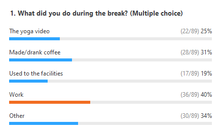

Members of the FABRIC Leadership Team recently had the privilege of working with the organizers of the Huge Data Workshop as well as organizing the FABRIC Community Workshop. In both cases, the workshops were moved from their original face-to-face venues to abbreviated online formats to accommodate the spread of SARS-CoV-2 across the globe. Throughout the planning process and the cumulative four days of workshops including more than 350 attendees spread across 15 countries, the planning team learned many lessons. [These lessons have been gathered in a report](https://drive.google.com/file/d/1KMoA1ub27gw3jQ4yjAK8eu-fApDl-Qnv/view?usp=sharing), but key takeaways are also included below: 

## 1. Identify the Right Virtual Meeting Format 

There are many different technologies to support virtual meetings and often different settings within each virtual meeting software. We used Zoom, but the lessons learned are technology agnostic. There are many ways to use Zoom: webinars, meetings, breakout rooms. Our events consisted of both presentation-focused sessions and discussion-focused sessions. We utilized Zoom Webinars for presentation-focused sessions and Zoom Meetings for discussion-focused sessions. Since moving between session types requires joining new Zooms, minimizing the amount of switches makes the overall experience smoother. We found it most helpful to structure the agenda by starting with presentation-focused sessions and moving to discussion-focused sessions. This limited the number of times the attendees had to join a new Zoom to only once or twice a day. 

## 2. Create a Welcome Packet

Our Welcome Packet Google Doc was the most useful tool we had during both events. It served as a centralized place for attendees to find information and answers to most of their questions. It also helped organizers quickly and easily answer most logistical questions (e.g., where do I find the Zoom information? where do I find the reading material?). We’d simply direct them to the Welcome Packet. 

As an example, here is the FABRIC [Welcome Packet](http://bit.ly/FCW-WelcomePacket). Having the quick links at the top is very useful. To make that section even more user friendly, consider adding a table of contents to provide further clarity and direction.

Another wise choice would be to add the [bit.ly link](https://docs.google.com/document/d/1sF9hckZa_XizZ_ykre2SEQbPHkXJlE90V6zc45q4rzg/edit#heading=h.lccy2hxc4qsq) to the Welcome Packet on the bottom of each presentation slide so that it is front and center for attendees at all times.   

## 3. Choose a User-Friendly Communication Platform

In addition to a space for consuming content and seeing each other, your attendees need an asynchronous way to connect. Again, there are many technologies for this. We chose Slack. Next to the Welcome Packet, Slack was the most utilized resource for the virtual event. In addition to serving as a central hub for communication among attendees, it also  provided a convenient place for attendees to locate important event documents. 

## 4. Include Breaks

Don’t forget to schedule breaks - especially around lunch time - during your event. Sitting in front of a computer on [Zoom meetings can be draining](http://www.bbc.com/worklife/article/20200421-why-zoom-video-chats-are-so-exhausting), especially if meetings last most of the day. Adding in breaks before each new group of presentations is an efficient way to do this. These breaks have the added benefit of allowing presenters a chance to test their audio/video/screen sharing before each session starts.

Feel free to add some creativity to the breaks. During one of our breaks, we played [this yoga video](https://youtu.be/EHMRMibVO2I), and it was a hit! Attendees requested additional yoga videos during later breaks. After the yoga video ended, we polled the attendees using Zoom polls. The results are below.

## 5. Build a Strong Team

Virtual events take just as much - if not more - planning as face-to-face events. Before you decide to take your face-to-face event virtual, make sure you have a strong team around you that has the time to execute a successful event.

For full exploration of how we structured our event and what we would do differently next time, view the [Virtual Events: Lessons Learned During a Pandemic Report](https://drive.google.com/file/d/1KMoA1ub27gw3jQ4yjAK8eu-fApDl-Qnv/view?usp=sharing).
