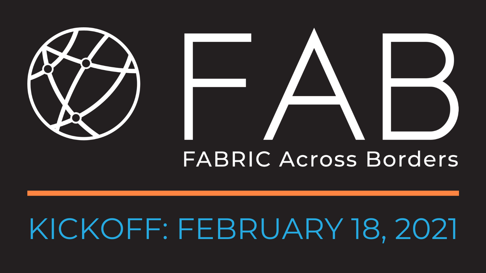

February 18, 2021 marked the official kickoff of the <a href="https://fabric-testbed.net/about/fab" target="_blank" rel="noopener noreferrer">FABRIC Across Borders</a> (FAB) project, an extension of the FABRIC testbed connecting the core North America infrastructure to four nodes in Asia, Europe, and South America. Researchers from across these continents gathered to present their planned FAB use cases and share resources that may be useful to their collaborators.

FABRIC Testbed leadership team members Anita Nikolich and Kuang-Ching Wang started the FAB Kickoff by welcoming everyone to the event. Nikolich expressed her gratitude to the many different players who had been involved with the process of making FAB possible — including the FAB Team, the National Science Foundation, and the experimenters — and their patience in participating in the project, despite delays caused by the COVID-19 pandemic. Nikolich then outlined the story of FAB and gave an overview of partner commitments, goals, and milestones.

“By placing FABRIC nodes in strategic global locations, we can enable programmable network connectivity that drives innovative research across continents,” said Anita Nikolich, FAB Principal Investigator. “The FAB Kickoff gives us the chance to explore the valuable ways that our partners intend to use the FAB infrastructure to create international collaboration, and to exchange resources and ideas to support their efforts.”

The introduction from Nikolich was followed by a partner roll call, beginning with talks from representatives at networks that will connect FABRIC to international sites: Jennifer Schopf, Director of International Networks at Indiana University <a href="https://internationalnetworks.iu.edu/projects/NEA3R/index.html" target="_blank" rel="noopener noreferrer">(NEA3R)</a>, and Julio Ibarra, Assistant Vice President of Technology Augmented Research at Florida International University <a href="https://www.amlight.net/" target="_blank" rel="noopener noreferrer">(AmLight)</a>. After Schopf and Ibarra shared information about the resources they could provide, presentations from partner universities and centers began.

To ensure the project meets the needs of the scientists it aims to serve, FAB will be built around use cases led by scientific partners in five areas: physics, space, smart cities, weather, and computer science. A selection of the presentations made are summarized below.

The University of Bristol’s <a href="http://bristol.ac.uk/engineering/research/smart/" target="_blank" rel="noopener noreferrer">Smart Internet Lab</a> is working on emerging network technologies for Smart Cities and Connected Communities. With this new collaboration, their team will exceed national boundaries and exploit the benefits of programmable networks in urban experimentation. A FABRIC node will be hosted using the University of Bristol’s infrastructure and the Smart Internet Lab's 5GUK Test Network, allowing their team to connect and collaborate internationally at an unprecedented scale.

“We are delighted to be one of just four internationally leading scientific institutions to become part of the FAB global testbed infrastructure. FAB will enable domain scientists to perform global, large-scale, end-to-end experimentation of new cyberinfrastructure workflow ideas on a platform with one-of-a-kind capabilities,” said Professor Dimitra Simeonidou, director, Smart Internet Lab at the University of Bristol. “Through our collaboration, we will understand how cities, communities, and citizens will be able to consume advanced network services and observe commonalities and differences in the terms of technology, deployment scale, and diversity. This represents a significant opportunity not just for our researchers and students, but for the region, and reinforces Bristol’s position as a world-leading smart city and region.”

Located in Chile, the <a href="https://www.lsst.org/" target="_blank" rel="noopener noreferrer">Rubin Observator</a> will execute the Legacy Survey of Space and Time (LSST), a planned 10-year survey of the southern sky which will examine one-third of the sky each night and detect billions of stars and galaxies and millions of transients, variables, and moving objects — a data set of unprecedented volume and complexity.

“A major product of the nightly processing of Rubin images is a world-public stream of alerts from transient, variable, and moving sources, which users will access through a worldwide network of community brokers,” said William O'Mullane at the Rubin Observatory. “At this time, we estimate that we can support five of the eight community brokers proposed. We hope that utilizing more clever networking with filtering capabilities through FAB may allow that number to increase and decrease latency across the board.”

Following the presentations, Nikolich began reviewing site installation documents and marketing materials. Schopf and Ibarra volunteered ideas for how their institutions could provide a physical structure to make projects at partner institutions successful. Although these projects are siloed across the world, the researchers’ willingness to work together and help each other create efficient pathways reflects the intention of the FAB project as a whole — to accelerate scientific collaboration and discovery for research teams across the globe.

To learn more about FAB and its partners, visit: <a href="https://fabric-testbed.net/about/fab" target="_blank" rel="noopener noreferrer">https://fabric-testbed.net/about/fab</a>.
